<!-- ██████████████████████████████████████████████████████████████████████████ -->
<!--   RUTVIK PRAJAPATI  ·  AI ENGINEER  ·  MAXIMUM-TIER GITHUB PROFILE 2025  -->
<!--   Neural · Cyberpunk · Gradient · Data Science · Elite                    -->
<!-- ██████████████████████████████████████████████████████████████████████████ -->

<!--
  ╔══════════════════════════════════════════════════════════════════════════╗
  ║  SETUP CHECKLIST (one-time, 5 minutes):                                  ║
  ║                                                                          ║
  ║  1. Upload header.svg → root of Rutvik5o/Rutvik5o repo                   ║
  ║                                                                          ║
  ║  2. Create a GitHub PAT (Settings → Developer Settings →                 ║
  ║     Personal Access Tokens → Fine-grained):                              ║
  ║     Permissions: read:user, read:packages, repo (read)                   ║
  ║     → Save as repo secret: METRICS_TOKEN                                 ║
  ║                                                                          ║
  ║  3. Upload generate-stats.yml →                                          ║
  ║     .github/workflows/generate-stats.yml                                 ║
  ║                                                                          ║
  ║  4. Go to Actions tab → Run "Generate GitHub Stats Cards" manually once  ║
  ║     This creates the `dist` and `output` branches automatically          ║
  ║                                                                          ║
  ║  5. Push this README.md → everything auto-updates every 8 hours ✅       ║
  ╚══════════════════════════════════════════════════════════════════════════╝
-->

<div align="center">

<!-- ┌─────────────────────────────────────────────────────┐ -->
<!--  │        CUSTOM ANIMATED SVG HERO HEADER              │ -->
<!-- └─────────────────────────────────────────────────────┘ -->



</div>

<!-- ━━━━━━━━━━━━━━━━━━━━━━━━━━━━━━━━━━━━━━━━━━━━━━━━━━━━━━━━━━━━━━━━━ -->

<div align="center">

[](https://git.io/typing-svg)

<br/>


&nbsp;

&nbsp;

&nbsp;

&nbsp;


<br/>


</div>

---

<!-- ━━━━━━━━━━━━━━━━━━━━━━━━━━━━━━━━━━━━━━━━━━━━━━━━━━━━━━━━━━━━━━━━━ -->
<!--                        ABOUT ME                                    -->
<!-- ━━━━━━━━━━━━━━━━━━━━━━━━━━━━━━━━━━━━━━━━━━━━━━━━━━━━━━━━━━━━━━━━━ -->


### `⚡ $ whoami --verbose`

```
╔══════════════════════════════════════════════════╗
║  IDENTITY                                        ║
║  ─────────────────────────────────────────────   ║
║  name      →  Rutvik Prajapati                  ║
║  role      →  AI Engineer · ML Architect        ║
║  institute →  AIDTM, Ahmedabad 🎓               ║
║  location  →  India 🇮🇳                           ║
║  uptime    →  20+ years  🟢                      ║
╠══════════════════════════════════════════════════╣
║  ACTIVE MODULES                                  ║
║  ─────────────────────────────────────────────   ║
║   ◈  Generative AI · LLM Fine-tuning             ║
║   ◈  Transformer Architectures · BERT · GPT      ║
║   ◈  RAG Systems · Vector DBs · AI Agents        ║
║   ◈  Computer Vision · YOLO · CNNs · CLIP        ║
║   ◈  NLP · Sentiment · NER · Summarization       ║
║   ◈  MLOps · Docker · FastAPI · AWS · GCP        ║
╠══════════════════════════════════════════════════╣
║  LOADING MODULES                                 ║
║  ─────────────────────────────────────────────   ║
║   ⚡ Agentic AI     [████████░░]  80%            ║
║   ⚡ Diffusion Mdls [██████░░░░]  60%            ║
║   ⚡ Multi-modal    [█████░░░░░]  55%            ║
║   ⚡ Federated ML   [████░░░░░░]  45%            ║
╚══════════════════════════════════════════════════╝
```

<br clear="right"/>

---

<!-- ━━━━━━━━━━━━━━━━━━━━━━━━━━━━━━━━━━━━━━━━━━━━━━━━━━━━━━━━━━━━━━━━━ -->
<!--                   PYTHON ENGINEER CODE CARD                        -->
<!-- ━━━━━━━━━━━━━━━━━━━━━━━━━━━━━━━━━━━━━━━━━━━━━━━━━━━━━━━━━━━━━━━━━ -->

```python
#!/usr/bin/env python3
# ╔══════════════════════════════════════════════════════════════════════╗
# ║  rutvik_prajapati.py  ·  AI Engineer  ·  AIDTM, Ahmedabad  🇮🇳        ║
# ╚══════════════════════════════════════════════════════════════════════╝
from __future__ import annotations
from dataclasses import dataclass, field
from typing import ClassVar, Final

@dataclass(frozen=True)
class RutvikPrajapati:
    """
    ⚡ AI Engineer who architects intelligent systems that think,
       reason, learn, and create — at production scale.
    """

    # ── Identity ────────────────────────────────────────────────────────
    name:      Final[str] = "Rutvik Prajapati"
    role:      Final[str] = "AI Engineer · ML Architect · Data Scientist"
    institute: Final[str] = "AIDTM — Ahmedabad Institute of Digital Technology Management"
    location:  Final[str] = "Ahmedabad, India 🇮🇳"

    # ── Arsenal ─────────────────────────────────────────────────────────
    STACK: ClassVar[dict[str, list[str]]] = {
        "🧠 Deep Learning" : ["PyTorch", "TensorFlow", "Keras", "JAX", "ONNX"],
        "🤖 Generative AI" : ["LangChain", "LlamaIndex", "HuggingFace 🤗", "OpenAI"],
        "📊 Data Science"  : ["Pandas", "NumPy", "Polars", "PySpark", "Plotly"],
        "👁  Vision"       : ["OpenCV", "YOLO", "Detectron2", "CLIP", "SAM"],
        "🗣  NLP"          : ["BERT", "Transformers", "spaCy", "NLTK", "Gensim"],
        "🚀 MLOps"         : ["FastAPI", "Docker", "Kubernetes", "Airflow", "MLflow"],
        "☁  Cloud"         : ["AWS SageMaker", "GCP Vertex AI", "Pinecone", "Redis"],
    }

    # ── Live Missions ───────────────────────────────────────────────────
    SHIPPING: ClassVar[list[str]] = [
        "🔥 Fine-tuning LLaMA-3.1 8B with QLoRA on domain corpus",
        "⚡ Multi-hop RAG: Pinecone + LangChain + Reranker + FastAPI",
        "🌐 Vision AI platform: YOLO · Django · TF Serving · React",
        "🧬 Autonomous AI Agents with memory, planning & tool-use",
        "📊 Real-time ML Dashboard: Streamlit + WebSockets + Kafka",
    ]

    def philosophy(self) -> str:
        return "Data is the new oil. AI is the refinery. 🛢️ → ⚡"

    def mantra(self) -> str:
        return "Code it. Train it. Deploy it. Improve it. Repeat. 🔄"

    def __str__(self) -> str:
        return (
            f"<AIEngineer name={self.name!r} "
            f"institute='AIDTM' status='Building intelligence 🚀'>"
        )

if __name__ == "__main__":
    me = RutvikPrajapati()
    print(me)
    # → <AIEngineer name='Rutvik Prajapati' institute='AIDTM' status='Building intelligence 🚀'>
    print(me.philosophy())
    # → Data is the new oil. AI is the refinery. 🛢️ → ⚡
```

---

<!-- ━━━━━━━━━━━━━━━━━━━━━━━━━━━━━━━━━━━━━━━━━━━━━━━━━━━━━━━━━━━━━━━━━ -->
<!--                       TECH ARSENAL                                  -->
<!-- ━━━━━━━━━━━━━━━━━━━━━━━━━━━━━━━━━━━━━━━━━━━━━━━━━━━━━━━━━━━━━━━━━ -->

<div align="center">

## ⚡ Arsenal of Intelligence

<table>
<tr>
<td valign="top" width="50%" align="center">

**🔴 AI · Deep Learning · LLMs**


</td>
<td valign="top" width="50%" align="center">

**🟢 Data Science · Analytics · Viz**


</td>
</tr>
<tr>
<td valign="top" width="50%" align="center">

**🔵 MLOps · Cloud · Infra**


</td>
<td valign="top" width="50%" align="center">

**🟡 Languages · DB · Tools**


</td>
</tr>
</table>

### ⚙️ Full Tool Stack


</div>

---

<!-- ━━━━━━━━━━━━━━━━━━━━━━━━━━━━━━━━━━━━━━━━━━━━━━━━━━━━━━━━━━━━━━━━━ -->
<!--   GITHUB STATS — static SVGs via GitHub Actions → dist branch      -->
<!-- ━━━━━━━━━━━━━━━━━━━━━━━━━━━━━━━━━━━━━━━━━━━━━━━━━━━━━━━━━━━━━━━━━ -->

<div align="center">

## 📊 Mission Control — Stats Dashboard

<!-- ── Streak card (demolab — always works) ── -->


<br/><br/>

<!-- ── Full profile card (habits, isocalendar, activity, repos — all in one) ── -->


<br/>

<!-- ── Language breakdown ── -->


<br/>

<!-- ── Full-year contribution heatmap ── -->


</div>

---

<!-- ━━━━━━━━━━━━━━━━━━━━━━━━━━━━━━━━━━━━━━━━━━━━━━━━━━━━━━━━━━━━━━━━━ -->
<!--       ACHIEVEMENTS — STATIC SVG via GitHub Actions                  -->
<!-- ━━━━━━━━━━━━━━━━━━━━━━━━━━━━━━━━━━━━━━━━━━━━━━━━━━━━━━━━━━━━━━━━━ -->

<div align="center">

## 🏆 Hall of Achievements


</div>

---

<!-- ━━━━━━━━━━━━━━━━━━━━━━━━━━━━━━━━━━━━━━━━━━━━━━━━━━━━━━━━━━━━━━━━━ -->
<!--                    NEURAL SKILL MATRIX                              -->
<!-- ━━━━━━━━━━━━━━━━━━━━━━━━━━━━━━━━━━━━━━━━━━━━━━━━━━━━━━━━━━━━━━━━━ -->

<div align="center">

## 🧠 Neural Skill Matrix

</div>

```
╔══════════════════════════════════════════════════════════════════════════╗
║  RUTVIK PRAJAPATI  ·  AI ENGINEER  ·  NEURAL BENCHMARK RESULTS          ║
╠══════════════════════════════════════════════════════════════════════════╣
║  DOMAIN               PROFICIENCY BENCHMARK                    TIER      ║
║  ─────────────────────────────────────────────────────────────────────   ║
║  🧠 Deep Learning     ██████████████████████████░░  93%      EXPERT     ║
║  📊 Data Science      █████████████████████████░░░  91%      EXPERT     ║
║  🤖 Generative AI     ████████████████████████░░░░  88%      ADVANCED   ║
║  🗣  NLP & Text AI    ███████████████████████░░░░░  84%      ADVANCED   ║
║  👁  Computer Vision  ████████████████████░░░░░░░░  78%      SKILLED    ║
║  🚀 MLOps & Deploy    ██████████████████░░░░░░░░░░  73%      SKILLED    ║
║  ☁  Cloud & Infra     ████████████████░░░░░░░░░░░░  68%      GROWING    ║
║  🤖 AI Agents         █████████████░░░░░░░░░░░░░░░  58%      LOADING    ║
╠══════════════════════════════════════════════════════════════════════════╣
║  AGGREGATE INTELLIGENCE SCORE  ──────────────────  82%    🥷 AI_NINJA   ║
╚══════════════════════════════════════════════════════════════════════════╝
```

---

<!-- ━━━━━━━━━━━━━━━━━━━━━━━━━━━━━━━━━━━━━━━━━━━━━━━━━━━━━━━━━━━━━━━━━ -->
<!--               DATA SCIENCE WORKFLOW CARD                           -->
<!-- ━━━━━━━━━━━━━━━━━━━━━━━━━━━━━━━━━━━━━━━━━━━━━━━━━━━━━━━━━━━━━━━━━ -->

<div align="center">

## 📈 The Data Science Loop

</div>

```python
# ── Rutvik's Full Data Science Engineering Pipeline ──────────────────────────
import pandas as pd, numpy as np, torch
from sklearn.pipeline import Pipeline
from sklearn.model_selection import cross_val_score
import optuna, mlflow, shap

def build_intelligence(raw_data: pd.DataFrame) -> dict:
    """
    ╔═══════════════════════════════════════════════════════════════════════╗
    ║  STEP 1 │ 🔍 EXPLORE     →  EDA · heatmaps · distributions · outliers║
    ║  STEP 2 │ 🧹 CLEAN       →  impute · encode · normalize · dedupe     ║
    ║  STEP 3 │ 🔧 ENGINEER    →  PCA · embeddings · domain features       ║
    ║  STEP 4 │ 🧠 MODEL       →  XGBoost · PyTorch · Transformer · BERT   ║
    ║  STEP 5 │ ⚡ OPTIMIZE    →  Optuna HPO · early stopping · scheduler  ║
    ║  STEP 6 │ 📏 EVALUATE    →  AUC · F1 · RMSE · confusion matrix       ║
    ║  STEP 7 │ 🔬 EXPLAIN     →  SHAP · LIME · attention weights          ║
    ║  STEP 8 │ 🐳 CONTAINERIZE→  Docker · FastAPI · health checks         ║
    ║  STEP 9 │ ☁  DEPLOY      →  AWS SageMaker / GCP Vertex AI            ║
    ║  STEP 10│ 📡 MONITOR     →  drift detection · latency · A/B test     ║
    ║  STEP 11│ 🔄 RETRAIN     →  scheduled retraining · data pipelines    ║
    ╚═══════════════════════════════════════════════════════════════════════╝
    """
    with mlflow.start_run():
        study = optuna.create_study(direction="maximize")
        study.optimize(lambda trial: cross_val_score(...).mean(), n_trials=100)
        mlflow.log_params(study.best_params)
        mlflow.log_metric("best_score", study.best_value)

    return {"status": "🚀 deployed", "accuracy": "state_of_the_art", "serving": "FastAPI + Docker"}

# philosophy: "Without data you're just another person with an opinion." — W.E. Deming
```

---

<!-- ━━━━━━━━━━━━━━━━━━━━━━━━━━━━━━━━━━━━━━━━━━━━━━━━━━━━━━━━━━━━━━━━━ -->
<!--               AI ENGINEERING SYSTEM DIAGRAM                        -->
<!-- ━━━━━━━━━━━━━━━━━━━━━━━━━━━━━━━━━━━━━━━━━━━━━━━━━━━━━━━━━━━━━━━━━ -->

<div align="center">

## 🧬 AI Engineering Pipeline

</div>

```
╔═══════════════════════════════════════════════════════════════════════════╗
║              RUTVIK'S PRODUCTION AI ENGINEERING SYSTEM                    ║
╠══════════════╦══════════════╦═══════════════╦═══════════════════════════╣
║   DATA IN    ║  PROCESSING  ║    MODELING   ║       PRODUCTION          ║
╠══════════════╬══════════════╬═══════════════╬═══════════════════════════╣
║  📄 Text     ║  🔤 Tokenize ║  🤗 BERT /    ║  🌐 FastAPI  REST        ║
║  🖼 Images   ║  🔍 Feature  ║    GPT  /     ║  🐳 Docker  Container    ║
║  📊 Tables   ║     Extract  ║    LLaMA /    ║  ☸  Kubernetes  Scale    ║
║  🎤 Audio    ║  📐 Embed    ║    Mistral    ║  ☁  AWS / GCP  Cloud     ║
║  🌐 Web Data ║  🗄 Pinecone ║               ║  📊 MLflow  Monitor      ║
╠══════════════╩══════════════╩═══════════════╩═══════════════════════════╣
║                                                                           ║
║   INPUT ──► [TRANSFORMER] ──► PREDICTION ──► API ──► USERS              ║
║                │                                        │                ║
║            Fine-tune                           Feedback Loop             ║
║            (LoRA/QLoRA)                      (Retrain on Errors)         ║
║                                                                           ║
╠═══════════════════════════════════════════════════════════════════════════╣
║  RAG PIPELINE:  Query → Embed → Pinecone Search → Rerank → LLM → Answer ║
║  AGENT LOOP:    Observe → Think → Plan → Act (Tools) → Reflect → Repeat  ║
╚═══════════════════════════════════════════════════════════════════════════╝
```

---

<!-- ━━━━━━━━━━━━━━━━━━━━━━━━━━━━━━━━━━━━━━━━━━━━━━━━━━━━━━━━━━━━━━━━━ -->
<!--                    CURRENT PROJECTS                                 -->
<!-- ━━━━━━━━━━━━━━━━━━━━━━━━━━━━━━━━━━━━━━━━━━━━━━━━━━━━━━━━━━━━━━━━━ -->

<div align="center">

## 🔥 Currently Shipping

<table>
<tr>
<th>⚡ Project</th>
<th>🛠 Stack</th>
<th>🧠 Domain</th>
<th>📡 Status</th>
</tr>
<tr>
<td>🤖 <b>LLM Fine-Tuner</b></td>
<td>LLaMA-3.1 · QLoRA · PEFT · HuggingFace</td>
<td>Generative AI</td>
<td>🔥 Active</td>
</tr>
<tr>
<td>📡 <b>Multi-hop RAG</b></td>
<td>LangChain · Pinecone · Reranker · FastAPI</td>
<td>NLP · Retrieval</td>
<td>⚡ Progress</td>
</tr>
<tr>
<td>👁 <b>Vision AI App</b></td>
<td>YOLO · OpenCV · Django · TF Serving</td>
<td>Computer Vision</td>
<td>🟡 Beta</td>
</tr>
<tr>
<td>🗣 <b>NLP Dashboard</b></td>
<td>BERT · Streamlit · Kafka · Seaborn</td>
<td>Data Science</td>
<td>✅ Shipped</td>
</tr>
<tr>
<td>🧬 <b>AI Agent System</b></td>
<td>LangChain · Tools · Memory · Planning</td>
<td>Agentic AI</td>
<td>🌱 Research</td>
</tr>
<tr>
<td>📊 <b>ML API Platform</b></td>
<td>FastAPI · Docker · K8s · AWS · Postgres</td>
<td>MLOps</td>
<td>📋 Planning</td>
</tr>
</table>

</div>

---

<!-- ━━━━━━━━━━━━━━━━━━━━━━━━━━━━━━━━━━━━━━━━━━━━━━━━━━━━━━━━━━━━━━━━━ -->
<!--                 CONTRIBUTION ACTIVITY GRAPH                         -->
<!-- ━━━━━━━━━━━━━━━━━━━━━━━━━━━━━━━━━━━━━━━━━━━━━━━━━━━━━━━━━━━━━━━━━ -->

<div align="center">

## 🌊 Neural Activity Graph


</div>

---

<!-- ━━━━━━━━━━━━━━━━━━━━━━━━━━━━━━━━━━━━━━━━━━━━━━━━━━━━━━━━━━━━━━━━━ -->
<!--        SNAKE — from your own repo's output branch                   -->
<!-- ━━━━━━━━━━━━━━━━━━━━━━━━━━━━━━━━━━━━━━━━━━━━━━━━━━━━━━━━━━━━━━━━━ -->

<div align="center">

## 🐍 Consuming Knowledge · Every Single Day

<picture>
  <source media="(prefers-color-scheme: dark)"
    srcset="https://raw.githubusercontent.com/Rutvik5o/Rutvik5o/output/github-contribution-grid-snake-dark.svg">
  <source media="(prefers-color-scheme: light)"
    srcset="https://raw.githubusercontent.com/Rutvik5o/Rutvik5o/output/github-contribution-grid-snake.svg">
  
</picture>

</div>

---

<!-- ━━━━━━━━━━━━━━━━━━━━━━━━━━━━━━━━━━━━━━━━━━━━━━━━━━━━━━━━━━━━━━━━━ -->
<!--                        CONNECT                                      -->
<!-- ━━━━━━━━━━━━━━━━━━━━━━━━━━━━━━━━━━━━━━━━━━━━━━━━━━━━━━━━━━━━━━━━━ -->

<div align="center">

## 🌐 Establish Neural Link

<a href="https://linkedin.com/in/rutvik50">
  
</a>
&nbsp;
<a href="https://github.com/rutvik5o">
  
</a>
&nbsp;
<a href="https://x.com/@OzaRutvik50">
  
</a>
&nbsp;
<a href="https://quora.com/profile/Rutvik-Prajapati-64">
  
</a>
&nbsp;
<a href="https://pinterest.com/rutvik50">
  
</a>

<br/><br/>

<br/><br/>

```
╔═══════════════════════════════════════════════════════════════════╗
║                          OPEN TO:                                 ║
║                                                                   ║
║   ◈  AI / ML Engineering Collaborations & Research               ║
║   ◈  Open Source Contributions & Hackathons  🏆                  ║
║   ◈  Freelance AI / Data Science Consulting  💼                  ║
║   ◈  Research Paper Co-authoring  📄                             ║
║   ◈  Full-time AI/ML Engineering Opportunities  🚀               ║
║                                                                   ║
║   📧  Reach out — let's build something intelligent together!     ║
╚═══════════════════════════════════════════════════════════════════╝
```

<br/>


</div>

<!-- ══════════════════════════════════════════════════════════════════════ -->
<!--    Crafted with ⚡ intelligence · Rutvik Prajapati · AIDTM · 🇮🇳       -->
<!-- ══════════════════════════════════════════════════════════════════════ -->
